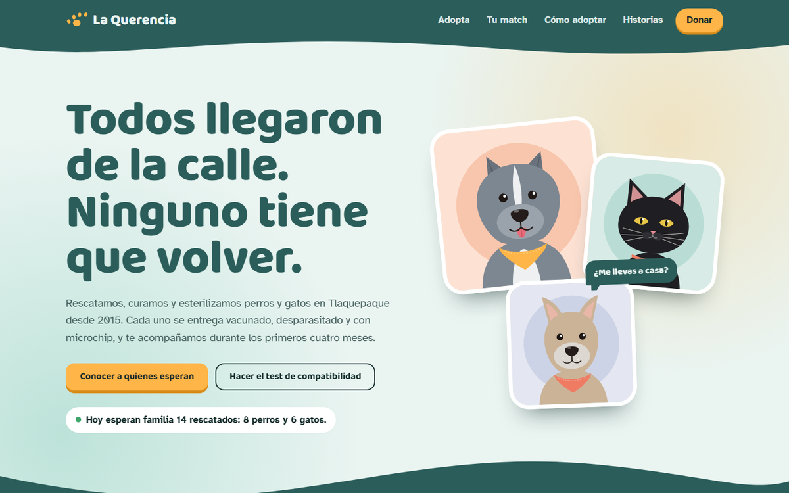
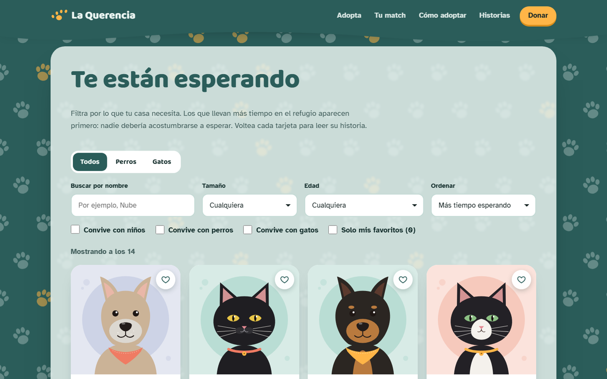
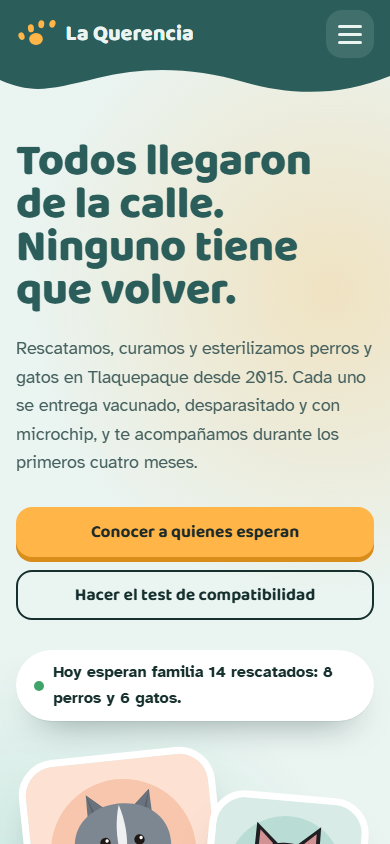

# La Querencia: rescate y adopción de mascotas


| | |
|---|---|
| **Tema** | Rescate y adopción de mascotas |
| **Técnica de canvas** | Fondo decorativo detrás de una sección |
| **Carpeta** | [`sexta pagina/`](../../sexta%20pagina/) |



## Canvas: fondo decorativo detrás de una sección

El `<canvas id="fondoHuellas">` es la capa de fondo de la sección "Te están esperando" (`position: absolute; z-index: 0`). El contenido va en otra capa encima (`position: relative; z-index: 1`), sobre un panel semitransparente que deja ver el patrón y mantiene el texto legible.

El patrón son **huellas de perro en filas alternadas**, separadas 104 px en computadora y 78 px en celular. Algunas son color mango. La primera vez que aparece la sección, un rastro de huellas cruza la pantalla en diagonal. Al bajar, el patrón se mueve más lento que el contenido (efecto de profundidad), y al pasar el mouse las huellas cercanas crecen. El fondo se redibuja con `ResizeObserver` cuando la sección cambia de alto al filtrar.

El canvas usa `devicePixelRatio` para verse nítido y lee los colores de la paleta con `getComputedStyle`.

## Paleta

| Color | Hex | Uso |
|---|---|---|
| Verde petróleo | `#2B5D5A` | Fondo del canvas, encabezado y pie |
| Mango | `#FFB547` | Huellas destacadas, botones, acentos |
| Niebla menta | `#EAF4F1` | Fondo de la página y panel semitransparente |

**Tipografía:** Baloo 2 para los títulos y Atkinson Hyperlegible para el texto.

## Secciones y funciones

- **Portada:** tres rescatados cuyos ojos siguen al cursor y parpadean. Al mover el mouse quedan huellas detrás. Cada retrato abre la ficha de esa mascota.
- **Te están esperando:** 14 mascotas ilustradas en SVG. Se filtran por especie, tamaño, edad, convivencia y nombre, y las tarjetas se reacomodan con una transición animada. Primero aparecen las que llevan más tiempo esperando. Cada tarjeta se voltea en 3D para leer su historia y tiene favoritos y una ficha con su salud y cuota de recuperación.
- **¿Quién encaja con tu vida?:** cinco preguntas, una a la vez. Un perrito camina por la barra de avance hasta llegar a casa y el test muestra a los tres más compatibles con su porcentaje y el porqué.
- **El camino a casa:** los cinco pasos unidos por un camino que se dibuja al bajar, con huellas a los lados. Los requisitos y las cuotas (₡23 000 cachorros, ₡17 500 adultos, sin cuota para seniors) cuelgan como placas de collar.
- **Solicitud de adopción:** formulario en tres pasos que se valida por partes. Al enviarlo genera un folio y un comprobante descargable.
- **Si hoy no puedes adoptar:** un plato que se llena de croquetas según el monto del donativo y explica qué cubre, el avance de una campaña en forma de hueso y la lista de lo que más falta.
- **Ya están en casa:** historias de adopción en un carrusel que se arrastra con el mouse o el dedo.
- **¿Encontraste un perro o gato?:** una guía en forma de cartel de "se busca" con tiras que se arrancan y copian el WhatsApp del refugio.



## Estructura

```
sexta pagina/
├── index.html          redirige a public/index.html
├── css/estilos.css
├── js/pagina6.js
├── img/                18 ilustraciones SVG
└── public/index.html   la página
```

`public/index.html` enlaza su CSS y su JS subiendo un nivel: `../css/estilos.css` y `../js/pagina6.js`. Dentro de `public/` solo está el HTML, sin CSS ni JavaScript mezclados.

## Responsive

1. La etiqueta de viewport en el `<head>`:
   ```html
   <meta name="viewport" content="width=device-width, initial-scale=1.0">
   ```
2. El canvas nunca es más ancho que su contenedor y su alto se ajusta en proporción:
   ```css
   canvas {
     max-width: 100%;
     height: auto;
   }
   ```
3. Al final de `css/estilos.css`, una media query para pantallas de menos de 640 px que acomoda el menú y las tarjetas de las mascotas en una sola columna. En celular, cada tarjeta pasa a formato horizontal (foto a la izquierda, datos a la derecha) para ocupar menos espacio:
   ```css
   @media (max-width: 639px) {
     .nav__lista { flex-direction: column; }
     .querencia-mascotas { grid-template-columns: minmax(0, 1fr); }
   }
   ```



## Cómo verla

No necesita servidor ni instalación. Abre con doble clic el `index.html` de la carpeta `sexta pagina`.

Las tipografías se cargan desde Google Fonts, así que se ve mejor con conexión a internet. Sin conexión, el navegador usa fuentes del sistema.

## Tecnologías

- **HTML5:** estructura semántica, `<dialog>` para la ficha de cada mascota, formulario en pasos
- **CSS3:** variables, Grid, Flexbox, `clamp()`, transformaciones 3D (`perspective`, `backface-visibility`) para voltear las tarjetas, `@property` para el anillo de compatibilidad, animaciones ligadas al scroll (`animation-timeline`), animaciones y transiciones
- **JavaScript sin librerías:** Canvas 2D, View Transitions API (filtros y ficha), Web Animations API, `IntersectionObserver`, `ResizeObserver`, `localStorage`, portapapeles y un comprobante `.txt` generado en el navegador
- **SVG:** 18 ilustraciones hechas para este sitio, además de los tres retratos de la portada dentro del HTML

## Notas

- La asociación, las mascotas, las personas, la dirección, el teléfono y el correo son **ficticios**.
- Los precios están en **colones costarricenses (CRC)** con el formato de Costa Rica, por ejemplo ₡23 000. El navegador los genera con `Intl.NumberFormat('es-CR', { currency: 'CRC' })`.
- Los formularios no envían datos a ningún servidor. Al terminar, abren la aplicación de correo con el mensaje listo y lo avisan en pantalla. Los favoritos se guardan solo en el navegador de quien visita.
- Las animaciones respetan la opción de **reducir movimiento** del sistema operativo: el contenido se muestra completo y sin desplazamientos. La página se puede recorrer con el teclado.
- Algunas animaciones usan funciones recientes del navegador (transiciones de vista y animaciones ligadas al scroll). En navegadores que no las tienen, la página funciona igual, sin ese efecto.

---

Proyecto académico de Desarrollo Web I.
